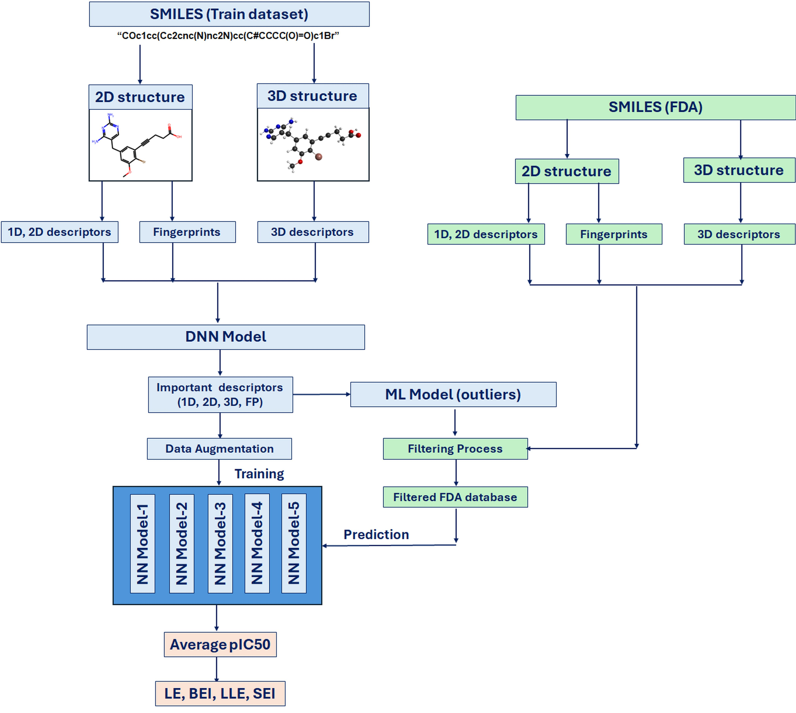

# **Deep Learning Regression Model with Data Augmentation for pIC50 Prediction of TgDHFR Inhibitors: FDA-Approved Drug Screening**

## **Abstract**
Toxoplasmosis, caused by Toxoplasma gondii (T. gondii), is a serious global health concern, particularly in immunocompromised individuals. Inhibiting the enzyme TgDHFR is a promising strategy for developing treatments. This study applies deep neural networks (DNNs) to predict pIC50 values for potential inhibitors, using 2D and 3D molecular descriptors, and fingerprints. Initially, the model achieved an R² of 0.75 with an original training dataset (873 entries). The most impactful descriptors were selected to improve accuracy, and the training data was augmented using Gaussian noise combined with an ensemble of DNN models. These enhancements increased the model’s performance to R² = 0.87. The model was additionally validated on two FDA-approved drugs using for T. gondii treatment, pyrimethamine and trimethoprim, with relative errors of 9.76% and 1.97%, respectively, in predicting pIC50 values compared to experimental data. The model was then applied to screen FDA-approved drugs after filtering out molecules that did not align with the characteristics of the training dataset. The predicted pIC50 values were further used to calculate ligand efficiency (LE), binding efficiency index (BEI), lipophilic ligand efficiency (LLE), and surface efficiency index (SEI), identifying the most promising TgDHFR inhibitors for further investigation. This approach demonstrates a robust and efficient method for pIC50 predictions of TgDHF inhibitors, which can be adapted to other systems.

## **Data Availability**
### **Training Datasets:**
- V2-1-database-all_TgDHFR_BindingDB.csv (extracted from BIndingDB database 'BindingDB_All_202406.tsv')
- ChMBL_TgDHFR.csv (extracted from CHMBL)

### **FDA Dataset:**
- PubChem_FDA-approved_NoInorganics.csv (extracted from PubChem)

## **Essential Libraries for the Project:**
### **Molecular Modeling and Drug Discovery:**
- rdkit – Chemical informatics and molecule operations.
- deepchem – Machine learning for drug discovery.
- padelpy – Access to PaDEL descriptors.
- PubChemPy – Interface with PubChem.
- nglview – Molecular visualization.
- OpenMM – Molecular simulations.

### **Machine Learning / Deep Learning:**
- tensorflow – Neural networks and deep learning.
- scikit-learn – General machine learning.
- keras – High-level neural network API.

### **Data Handling and Analysis:**
- numpy – Numerical operations.
- pandas – Data manipulation.
- scipy – Scientific computing.
- matplotlib – Plotting graphs.
- seaborn – Statistical data visualization.
- mlxtend – Additional ML tools.
- imbalanced-learn – Handle imbalanced datasets.
- joblib – Parallel processing.

### **Support Libraries:**
- biopython – Bioinformatics tools.
- openpyxl – Excel operations.
- requests – HTTP requests for APIs.
